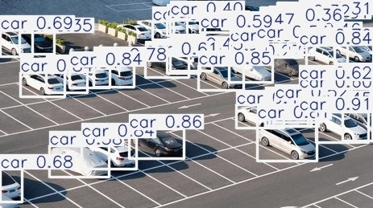
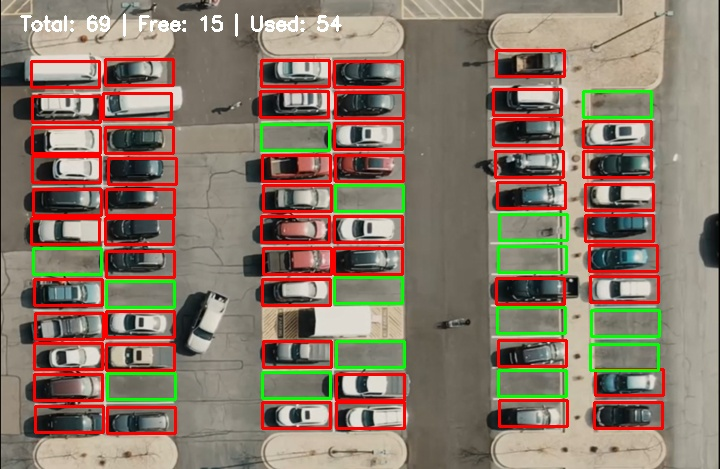

# Smart Parking Space Detection

A computer vision project that detects available and occupied parking spaces from a parking lot image using YOLO, OpenCV, and Streamlit.

## Project Overview

This project detects available and occupied parking spaces from images and videos using computer vision.

The project includes two detection methods:

1. YOLO Based Detection  
   This method uses a pretrained YOLO model to detect vehicles such as cars, trucks, and buses. The detected vehicle boxes are compared with manually selected parking space regions. If a vehicle overlaps with a parking space, the space is marked as occupied.

2. Pixel Based Detection  
   This method is designed for fixed camera parking lot views, especially top down CCTV style videos. It analyzes the visual details inside each selected parking space. If the amount of edge detail is higher than a threshold, the space is marked as occupied.

The project includes Python scripts for image and video processing, plus a Streamlit web application that supports image and video upload.

## Demo

### Streamlit App


### YOLO Based Normal Angle Result



### Pixel Based Top Down Result



### Video Processing Preview

.mp4)

## Features

1. Supports image input
2. Supports video input
3. Provides YOLO based vehicle detection
4. Provides pixel based fixed camera detection
5. Classifies parking spaces as available or occupied
6. Displays green boxes for available parking spaces
7. Displays red boxes for occupied parking spaces
8. Shows total, available, and occupied parking counts
9. Provides a Streamlit web interface
10. Allows users to adjust YOLO confidence threshold
11. Allows users to adjust overlap threshold
12. Allows users to adjust pixel threshold
13. Allows users to download the result image or video
14. Includes a manual parking space selection tool

## Tech Stack

Python  
OpenCV  
YOLO  
Ultralytics  
Streamlit  
NumPy  
Pillow  


## Project Structure

```text
smart-parking-detection/
    app.py
    requirements.txt
    README.md
    data/
        images/
            parking.jpg
        videos/
            parking.mp4
    outputs/
        smart_parking_result.jpg
        streamlit_result.jpg
        parking_video_result.mp4
    screenshots/
        streamlit_app.png
        detection_result.png
    src/
        __init__.py
        extract_frame.py
        parking_spaces.py
        parking_detector.py
        parking_detector_pixels.py
        select_spaces.py
        smart_parking.py
        smart_parking_pixels.py
        test_yolo.py
        video_parking.py
```

## How It Works

The project uses manually selected parking space coordinates stored in `parking_spaces.py`.

### YOLO Based Method

1. The user provides a parking lot image or video.
2. YOLO detects vehicles in the frame.
3. The app loads predefined parking space coordinates.
4. Each parking space is compared with detected vehicle boxes.
5. If a vehicle overlaps with a parking space enough, the space is marked as occupied.
6. If there is not enough overlap, the space is marked as available.

This method works best for normal camera views where YOLO can clearly detect vehicles.

### Pixel Based Method

1. The user provides a fixed camera parking lot image or video.
2. The frame is converted to grayscale.
3. Edge detection is applied using OpenCV.
4. Each selected parking space is cropped from the edge image.
5. The number of edge pixels inside each space is counted.
6. If the count is higher than the pixel threshold, the space is marked as occupied.
7. If the count is lower than the threshold, the space is marked as available.

This method works best for fixed top down or CCTV style parking lot videos.

## Color Legend

Green boxes mean available parking spaces.  
Red boxes mean occupied parking spaces.

## How to Run the Project

### 1. Clone the repository

```bash
git clone https://github.com/yourusername/smart parking detection.git
cd smart parking detection
```

### 2. Create a virtual environment

```bash
python -m venv venv
```

### 3. Activate the virtual environment

On Windows:

```bash
venv\Scripts\activate
```

On macOS or Linux:

```bash
source venv/bin/activate
```

### 4. Install dependencies

```bash
pip install -r requirements.txt
```

### 5. Run the Streamlit app

```bash
streamlit run app.py
```

### 6. Run the Python detection script

```bash
python src\smart_parking.py
```

## How to Select Parking Spaces

The project includes a manual parking space selection tool.

Run:

```bash
python src\select_spaces.py
```

Controls:

```text
Left click two corners of a parking space to add it
Right click to remove the last selected parking space
Press S to save selected spaces
Press Q to quit without saving
```

The selected parking spaces are saved automatically in:

```text
src/parking_spaces.py
```
## How to Extract a Frame From Video

For video processing, the parking spaces must be selected on a real frame from the same video. Do not use a Windows screenshot because it can change the image size and make the coordinates incorrect.

Run:

```bash
python src\extract_frame.py
```

This extracts a frame from:

```text
data/videos/parking.mp4
```

and saves it as:

```text
data/images/parking.jpg
```

After extracting the frame, run the parking space selector:

```bash
python src\select_spaces.py
```

## Output

The system produces an image or video with:

Total number of parking spaces  
Number of available spaces  
Number of occupied spaces  
Green boxes for available spaces  
Red boxes for occupied spaces  

Image outputs are saved in the `outputs` folder.  
Video outputs are also saved in the `outputs` folder.


## Streamlit Web App

The Streamlit app allows the user to:

Upload a parking lot image  
Upload a parking lot video  
Choose between YOLO Based and Pixel Based detection  
View the original image  
View the detection result  
Adjust YOLO confidence threshold  
Adjust parking overlap threshold  
Adjust pixel threshold  
See parking space statistics  
Download the result image  
Download the processed result video  

For top down fixed camera videos, the Pixel Based method usually works better.  
For normal camera angle images where YOLO detects cars correctly, the YOLO Based method can be used.

## Limitations

This project uses manually selected parking space coordinates. Because of this, the input image or video should have the same camera angle and frame size used when selecting the parking spaces.

If the camera angle changes, the parking spaces should be selected again.

The YOLO Based method depends on YOLO vehicle detection. It may not work well for top down or drone style views where cars look very small or different.

The Pixel Based method works well for fixed camera views, but the pixel threshold may need tuning depending on lighting, shadows, and video quality.

## Future Improvements

Train a custom YOLO model to detect empty and occupied parking spaces directly  
Allow parking space selection directly inside the Streamlit app  
Improve support for different camera angles  
Add automatic parking space detection  
Deploy the app online  
Add dashboard analytics  
Add support for multiple parking lot views  
Improve video preview inside the Streamlit app  

## What I Learned

Through this project, I practiced:

Computer vision basics  
Object detection using YOLO  
Image processing with OpenCV  
Pixel based parking occupancy detection  
Edge detection  
Manual annotation of parking spaces  
Bounding box overlap logic  
Threshold tuning  
Video frame processing  
Building a Streamlit web app  
Organizing a Python project  
Preparing a project for GitHub and portfolio use  

## Author

MOHAMMAD ESLAMI FAR